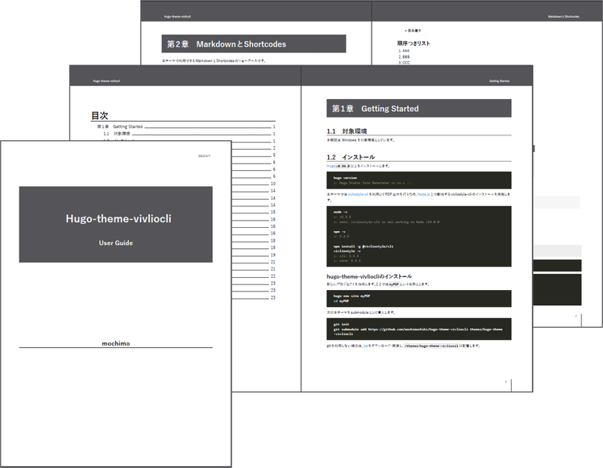

# hugo-theme-vivliocli

`hugo-theme-vivliocli` is a Hugo theme for building <u>**document sites that can output typeset PDF**</u>. This theme utilizes [Vivliostyle CLI](https://github.com/vivliostyle/vivliostyle-cli) to output any section of the site as a typeset PDF.

[](https://github.com/mochimochiki/hugo-theme-vivliocli/actions/workflows/gh-pages.yml)



## Features

#### Typeset PDF

Any section of the site with an `_pdf.md` file can be output as a <u>**typeset PDF with cover, table of contents, bookmarks, chapter numbers, and page numbers**</u> (powered by [Vivliostyle CLI](https://github.com/vivliostyle/vivliostyle-cli)). You can select between a book style with left and right pages or a simple style with all pages being the same. Chapter numbers are automatically assigned based on the hierarchy and header level of the Markdown file. You can specify the output level of chapter numbers and the format of the top-level (e.g. "Chapter X").

This User Guide is also a sample site built with Hugo-theme-vivliocli. The PDF is available [here](/exampleSite/content/en/UserGuide.pdf).

#### Drawing complex tables with merged cells

With the `include` shortcode, you can easily draw complex tables by including a CSV file in Markdown. Vertical `||` and horizontal `->` cell merging is possible. You can use Markdown syntax in each cell. You can also specify style settings such as the width of each column and text alignment.

#### Supports Mermaid and Mathjax

You can use [Mermaid](https://mermaid.js.org/) and [Mathjax](https://www.mathjax.org/) to leverage powerful diagram, chart, and math formula drawing capabilities.

#### Multiple editions of PDF output

You can use `ShowIf` / `HideIf` shortcodes to write blocks or files that are only output in specific editions. This makes it possible to output sets of PDFs with different levels of detail for multiple editions.

## Usage

```bash
hugo new site MySite
cd MySite
git init
git submodule add https://github.com/mochimochiki/hugo-theme-vivliocli themes/hugo-theme-vivliocli
```

see the [User Guide](https://mochimochiki.github.io/hugo-theme-vivliocli/en/) for details.
[日本語はこちら](https://mochimochiki.github.io/hugo-theme-vivliocli/ja/)

## Prerequisites

* Install [Hugo](https://github.com/gohugoio/hugo) (v0.94.0 or later).
* Install [Vivliostyle CLI](https://github.com/vivliostyle/vivliostyle-cli) (v5.3.0 or later).

## License

This project is licensed under the Apache License 2.0 - see the [LICENSE](https://github.com/mochimochiki/hugo-theme-vivliocli/blob/main/LICENSE) file for details.

Files in assets/js and static/css are licensed under [CC0-1.0](https://creativecommons.org/publicdomain/zero/1.0/legalcode) unless otherwise noted.
