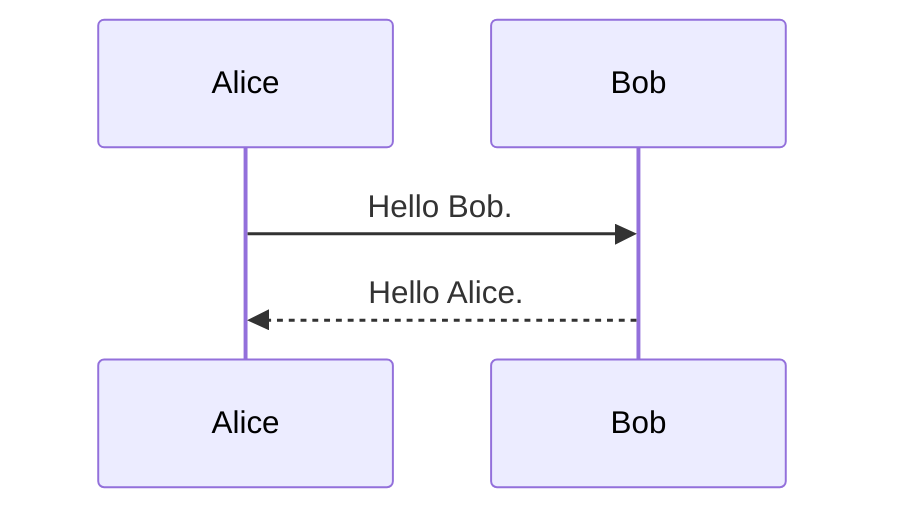
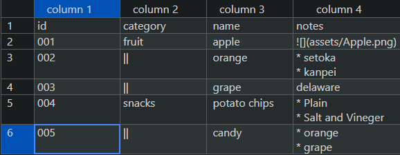

This is a showcase of Markdown and Shortcodes that can be used in this theme.

## Markdown

## Header 2

### Header 3

#### Header 4

##### Header 5

###### Header 6

### Text

Lorem ipsum dolor sit amet, consectetur adipiscing elit, sed do eiusmod tempor incididunt ut labore et dolore magna aliqua. Ut enim ad minim veniam, quis nostrud exercitation ullamco laboris nisi ut aliquip ex ea commodo consequat. Duis aute irure dolor in reprehenderit in voluptate velit esse cillum dolore eu fugiat nulla pariatur. Excepteur sint occaecat cupidatat non proident, sunt in culpa qui officia deserunt mollit anim id est laborum.

### Bulleted Lists

* bullet
  * bullet
  * bullet
    * bullet
* bullet
  * bullet

### Numbered Lists

1. AAA
1. BBB
1. CCC
    1. AAA
    1. BBB
    1. CCC
        * AAA
        * BBB
1. DDD
1. EEE

### Links

Link to [Google](https://www.google.com/).

### Table

Please also refer to [include](#include) for more advanced table expressions.

| No. | item | note |
| --- | --- | --- |
| 1    | AAA    | noteA |
| 2    | BBB    | noteB |
| 3    | CCC    | noteC |

### Quote

> This is a quote.

### Inline Code

`inlinecode`.

### Code Block

```
Formatted text.
```

```md
Formatted text.
```

```c#
// comment
if (a == b)
{
  return true;
}
```

### Footnote

This is a reference to Google[^1]. Here is a footnote reference,[^Z]

[^1]: This is a footnote text https://www.google.com/
[^Z]: Here is the footnote.

### Horizontal Rule

---

### Italic

*italic*

### Bold

**bold**

### Strikethrough

~~strikethrough~~

### MathJax

Inline math expressions are written as $y = ax^2 + \frac{b}{c}$. To enable inline math expressions, `math: true` needs to be added in the front matter.

Block math expressions are written as `math` code blocks.

```math
\frac{\pi}{2} =
\left( \int_{0}^{\infty} \frac{\sin x}{\sqrt{x}} dx \right)^2 =
\sum_{k=0}^{\infty} \frac{(2k)!}{2^{2k}(k!)^2} \frac{1}{2k+1} =
\prod_{k=1}^{\infty} \frac{4k^2}{4k^2 - 1}
```

### Mermaid

`mermaid` code blocks are rendered as diagrams written in [Mermaid](https://mermaid-js.org/).



### Images

#### Regular Image

Image without alternate text.


#### Inline

Display a small image inline. 

#### Figure

When an alternate text is provided, a figure number and caption will be attached.


If an alternate text contains only whitespace, no figure number or caption will be attached, and it will be centered.


#### Changing image size (adding attributes)

By adding attributes as URL query parameters, you can resize images or add borders.

```md

```


## Shortcodes

### ShowIf

Specify the part to be rendered when it is enumerated in `showIfs` in `config.toml`. The following block is rendered when `showIfs = ["edition1"]`.

```bash
{}
Content to be displayed if supporting xxx is written here.
{}
```

For more information, see [Editions](./edition.html).

### HideIf

Specify the part that is "not" rendered when it is enumerated in `showIfs` in `config.toml`. The following block will not be rendered when `showIfs = ["edition1"]`.

```bash
{}
This part will only be hidden when it is edition1.
{}
```

For more information, see [Editions](./edition.html).

### note

The part surrounded by the `note` shortcode is rendered as a note.

```
{}
This is where the note article is written.
{}
```
{}
This is where the note article is written.
{}

You can also specify a title as an argument in the format of `note (title)`. You can also write Markdown inside the note.

```bash
{}
This is where the note article is written.

* Markdown is also possible
  * List level 2
* List level 1
{}
```

{}
This is where the note article is written.

* Markdown is also possible
  * List level 2
* List level 1
{}

### now

Outputs the timestamp at the time of build execution in the specified format. The format should be based on the date and time of `2006/1/2 15:04:05 Mon`

```
{}
{}
```

{}
{}

### include

You can prepare "components" of Markdown files and csv files in advance and "insert" them anywhere in the article by specifying the relative path starting `.` for loading.

```bash
 # /(md file dir path)/test.csv
```

In addition, if you place the component files in `/content/<language>/_include`, you can include them as follows:

```bash
 # /content/en/_include/test_en.md
 # /content/en/_include/sample/sample_en.md
 # /content/en/_include/test_en.csv
```

* There is no front matter in the Markdown files in the _include directory.
* Write the include shortcode in `` style (no Markdown rendering). If you write it in `{}` style (with Markdown rendering), the csv loading may not work properly.

#### include csv

When including a csv file, you can draw a more advanced table than Markdown.

```bash
{{</* include 
      src="./rich.csv" # path to source file
      caption="Sample Table" # caption
      class="gray"      # class attribute added to the table. If unspecified, defaults to "simple"
      markdown=true     # if true, renders markdown inside the table. Defaults to false
      head=1         # if true, treats the first row as a header. Defaults to true. If a number, treats that number of rows as the header.
      align="left"  # align the table left/center/right. left / center / right
      head_align="center" # align all columns in the header of the table left/center/right. left / center / right
      body_align="left" # align all columns in the body of the table left/center/right. left / center / right
      width="90%"       # sets the width attribute of the table.
*/>}} 
```



#### CSV Format

##### Merge Rows and Columns

You can merge rows vertically using `||` and horizontally using `->`. You can also merge cells with the right cell using `<-` (indent expression).



##### ColumnCodes

You can embed ColumnCodes in the header (last row if multiple) to apply them to the column. ColumnCodes are codes in the format `[[@<identifier>=<value>]]`. They apply to the column by adding them to the end of the header cell. If you want to apply multiple codes, you can write them as `[[@<identifier>=<value> @<identifier>=<value>]]` separated by spaces. Here is a list of ColumnCodes.

|ColumnCodes|Description|
|:--|:--|
|`[[@id=myId]]` | Embeds `myColumnId` as the `class` attribute in all `<td>` tags in this column. |
|`[[@w=20%]]` | Sets the width of this column to 20% of the table. Columns without this code are treated as `auto`. If any of these codes exist, the `width_ratio` option in the `include` shortcode is ignored.|
|`[[@h:--]]` / `[[@h:--:]]` / `[[@h--:]]` | Aligns header text to the left/center/right (the number of `-` is arbitrary).|
| `[[@:--]]` / `[[@:--:]]` / `[[@--:]]` | Aligns body text to the left/center/right (the number of `-` is arbitrary).|



#### Reference Specific Values in CSV

You can also reference specific values in a CSV file by specifying a key to determine the row and a column name. The leftmost column is used as the key. If there are duplicate values, the first one found takes precedence.

```bash
 # Value in the "Name" column of the row matching "003" in /content/en/_include/test_en.csv
```

In the above example, the value in the `Name` column of the row where the first column value is `003` is inserted into the shortcode's position.

### PDFParam

Values such as `doctitle` and `author` described in the front matter of `_pdf.md` can be embedded in the document.

```sh
{}
{}
{}
```

{}
{}
{}