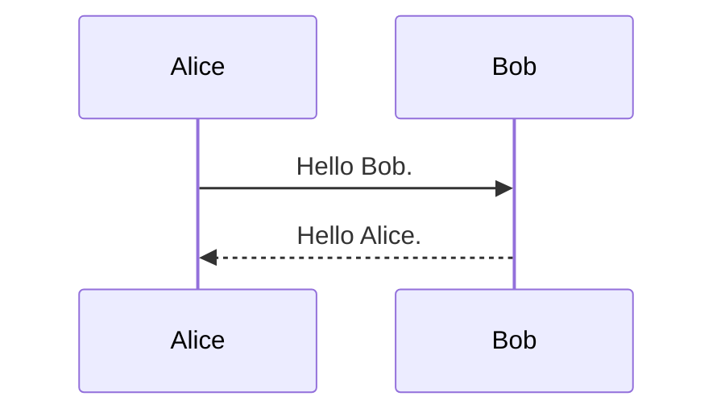

hugo-theme-vivliocli is a Hugo theme for building a <u>**document site that can output typeset PDFs**</u>. By using [Vivliostyle CLI](https://github.com/vivliostyle/vivliostyle-cli), any section of the site can be output as a PDF, including a cover page, table of contents, bookmarks, chapter numbers, and page numbers.

## Features

#### Typeset PDF output

Any section with a `_pdf.md` file can be output as a <u>**typeset PDF with a cover page, table of contents, bookmarks, chapter numbers, and page numbers**</u> (using [Vivliostyle CLI](https://github.com/vivliostyle/vivliostyle-cli)). The output format can be either a book-style with left / right pages or a simple style with all pages the same. Chapter numbers are automatically assigned based on the hierarchy of Markdown files and the header levels in each file. The output level of chapter numbers and the format of the top level (e.g., "Chapter X") can be specified.

This User Guide also serves as a sample for Hugo-theme-vivliocli. The PDF can be found [here](./UserGuide.pdf).

#### Drawing complex tables with cell merging

By using the include shortcode, you can load a csv file within Markdown and easily draw complex tables. You can merge cells vertically using `||` and horizontally using `->`. You can also use Markdown syntax in each cell and specify styles such as column width and text alignment.

{}

#### Support for Mermaid and Mathjax

You can use [Mermaid](https://mermaid.js.org/) and [Mathjax](https://www.mathjax.org/) to utilize powerful diagram, chart, and formula drawing capabilities.



```math
\frac{\pi}{2} =
\left( \int_{0}^{\infty} \frac{\sin x}{\sqrt{x}} dx \right)^2 =
\sum_{k=0}^{\infty} \frac{(2k)!}{2^{2k}(k!)^2} \frac{1}{2k+1} =
\prod_{k=1}^{\infty} \frac{4k^2}{4k^2 - 1}
```

#### Multiple edition PDF output

By using the `ShowIf` / `HideIf`  shortcode, you can write blocks or files that are output only for specific editions. This allows you to output PDFs for multiple editions with different details.

## Usage

First, please refer to <u>**[Getting Started](./Manual/GettingStarted.html)**</u>.

## Requirements

* [Hugo](https://gohugo.io/)(v0.114.0 or later)
* [Vivliostyle CLI](https://github.com/vivliostyle/vivliostyle-cli)(v8.6.0 or later)