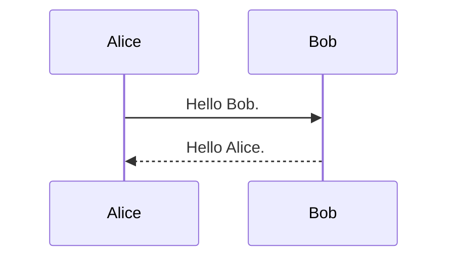
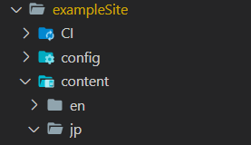
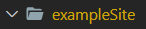
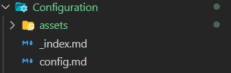

本テーマで利用できるMarkdownとShortcodesのショーケースです。

## Markdown

## Header 2

### Header 3

#### Header 4

##### Header 5

###### Header 6

### テキスト

> 吾輩わがはいは猫である。名前はまだ無い。
>
> どこで生れたかとんと見当けんとうがつかぬ。何でも薄暗いじめじめした所でニャーニャー泣いていた事だけは記憶している。吾輩はここで始めて人間というものを見た。しかもあとで聞くとそれは書生という人間中で一番獰悪どうあくな種族であったそうだ。この書生というのは時々我々を捕つかまえて煮にて食うという話である。しかしその当時は何という考もなかったから別段恐しいとも思わなかった。ただ彼の掌てのひらに載せられてスーと持ち上げられた時何だかフワフワした感じがあったばかりである。掌の上で少し落ちついて書生の顔を見たのがいわゆる人間というものの見始みはじめであろう。この時妙なものだと思った感じが今でも残っている。第一毛をもって装飾されべきはずの顔がつるつるしてまるで薬缶やかんだ。その後ご猫にもだいぶ逢あったがこんな片輪かたわには一度も出会でくわした事がない。のみならず顔の真中があまりに突起している。そうしてその穴の中から時々ぷうぷうと煙けむりを吹く。どうも咽むせぽくて実に弱った。これが人間の飲む煙草たばこというものである事はようやくこの頃知った。
>
> この書生の掌の裏うちでしばらくはよい心持に坐っておったが、しばらくすると非常な速力で運転し始めた。書生が動くのか自分だけが動くのか分らないが無暗むやみに眼が廻る。胸が悪くなる。到底とうてい助からないと思っていると、どさりと音がして眼から火が出た。それまでは記憶しているがあとは何の事やらいくら考え出そうとしても分らない。
> 
> ふと気が付いて見ると書生はいない。たくさんおった兄弟が一疋ぴきも見えぬ。肝心かんじんの母親さえ姿を隠してしまった。その上今いままでの所とは違って無暗むやみに明るい。眼を明いていられぬくらいだ。はてな何でも容子ようすがおかしいと、のそのそ這はい出して見ると非常に痛い。吾輩は藁わらの上から急に笹原の中へ棄てられたのである。
> 
> ようやくの思いで笹原を這い出すと向うに大きな池がある。吾輩は池の前に坐ってどうしたらよかろうと考えて見た。別にこれという分別ふんべつも出ない。しばらくして泣いたら書生がまた迎に来てくれるかと考え付いた。ニャー、ニャーと試みにやって見たが誰も来ない。そのうち池の上をさらさらと風が渡って日が暮れかかる。腹が非常に減って来た。泣きたくても声が出ない。仕方がない、何でもよいから食物くいもののある所まであるこうと決心をしてそろりそろりと池を左ひだりに廻り始めた。どうも非常に苦しい。そこを我慢して無理やりに這はって行くとようやくの事で何となく人間臭い所へ出た。ここへ這入はいったら、どうにかなると思って竹垣の崩くずれた穴から、とある邸内にもぐり込んだ。縁は不思議なもので、もしこの竹垣が破れていなかったなら、吾輩はついに路傍ろぼうに餓死がししたかも知れんのである。一樹の蔭とはよく云いったものだ。この垣根の穴は今日こんにちに至るまで吾輩が隣家となりの三毛を訪問する時の通路になっている。さて邸やしきへは忍び込んだもののこれから先どうして善いいか分らない。そのうちに暗くなる、腹は減る、寒さは寒し、雨が降って来るという始末でもう一刻の猶予ゆうよが出来なくなった。仕方がないからとにかく明るくて暖かそうな方へ方へとあるいて行く。今から考えるとその時はすでに家の内に這入っておったのだ。ここで吾輩は彼かの書生以外の人間を再び見るべき機会に遭遇そうぐうしたのである。第一に逢ったのがおさんである。これは前の書生より一層乱暴な方で吾輩を見るや否やいきなり頸筋くびすじをつかんで表へ抛ほうり出した。いやこれは駄目だと思ったから眼をねぶって運を天に任せていた。しかしひもじいのと寒いのにはどうしても我慢が出来ん。吾輩は再びおさんの隙すきを見て台所へ這はい上あがった。すると間もなくまた投げ出された。吾輩は投げ出されては這い上り、這い上っては投げ出され、何でも同じ事を四五遍繰り返したのを記憶している。その時におさんと云う者はつくづくいやになった。この間おさんの三馬さんまを偸ぬすんでこの返報をしてやってから、やっと胸の痞つかえが下りた。吾輩が最後につまみ出されようとしたときに、この家うちの主人が騒々しい何だといいながら出て来た。下女は吾輩をぶら下げて主人の方へ向けてこの宿やどなしの小猫がいくら出しても出しても御台所おだいどころへ上あがって来て困りますという。主人は鼻の下の黒い毛を撚ひねりながら吾輩の顔をしばらく眺ながめておったが、やがてそんなら内へ置いてやれといったまま奥へ這入はいってしまった。主人はあまり口を聞かぬ人と見えた。下女は口惜くやしそうに吾輩を台所へ抛ほうり出した。かくして吾輩はついにこの家うちを自分の住家すみかと極きめる事にしたのである。
>
> 夏目漱石(1905) 『吾輩は猫である』[青空文庫, 底本：「夏目漱石全集1」ちくま文庫、筑摩書房 1987（昭和62）年9月29日第1刷発行](https://www.aozora.gr.jp/cards/000148/files/789_14547.html)

### 脚注

脚注テスト Google[^1] です。
Here is a footnote reference,[^Z]

[^1]: 脚注テキスト https://www.google.co.jp/
[^Z]: Here is the footnote.


### 箇条書き

* 箇条書き
  * 箇条書き
  * 箇条書き
    * 箇条書き
* 箇条書き
  * 箇条書き

### 順序つきリスト

1. AAA
1. BBB
1. CCC
    1. AAA
    1. BBB
    1. CCC
        * AAA
        * BBB
1. DDD
1. EEE

### リンク

[Google](https://www.google.co.jp/) のリンク。

### 小さい表

| No. | item | note |
| --- | --- | --- |
| 1    | AAA    | noteA |
| 2    | BBB    | noteB |
| 3    | CCC    | noteC |

### 大きい表

| No. | item | note |
| --- | --- | --- |
| 1    | AAA    | 本文が多めです。本文が多めです。本文が多めです。本文が多めです。本文が多めです。本文が多めです。本文が多めです。本文が多めです。本文が多めです。 |
| 2    | BBB    | 本文が多めです。本文が多めです。本文が多めです。本文が多めです。本文が多めです。本文が多めです。本文が多めです。本文が多めです。本文が多めです。 |
| 3    | CCC    | 本文が多めです。本文が多めです。本文が多めです。本文が多めです。本文が多めです。本文が多めです。本文が多めです。本文が多めです。本文が多めです。 |
| 1    | AAA    | 本文が多めです。本文が多めです。本文が多めです。本文が多めです。本文が多めです。本文が多めです。本文が多めです。本文が多めです。本文が多めです。 |
| 2    | BBB    | 本文が多めです。本文が多めです。本文が多めです。本文が多めです。本文が多めです。本文が多めです。本文が多めです。本文が多めです。本文が多めです。 |
| 3    | CCC    | 本文が多めです。本文が多めです。本文が多めです。本文が多めです。本文が多めです。本文が多めです。本文が多めです。本文が多めです。本文が多めです。 |
| 1    | AAA    | 本文が多めです。本文が多めです。本文が多めです。本文が多めです。本文が多めです。本文が多めです。本文が多めです。本文が多めです。本文が多めです。 |
| 2    | BBB    | 本文が多めです。本文が多めです。本文が多めです。本文が多めです。本文が多めです。本文が多めです。本文が多めです。本文が多めです。本文が多めです。 |
| 3    | CCC    | 本文が多めです。本文が多めです。本文が多めです。本文が多めです。本文が多めです。本文が多めです。本文が多めです。本文が多めです。本文が多めです。 |
| 1    | AAA    | 本文が多めです。本文が多めです。本文が多めです。本文が多めです。本文が多めです。本文が多めです。本文が多めです。本文が多めです。本文が多めです。 |
| 2    | BBB    | 本文が多めです。本文が多めです。本文が多めです。本文が多めです。本文が多めです。本文が多めです。本文が多めです。本文が多めです。本文が多めです。 |
| 3    | CCC    | 本文が多めです。本文が多めです。本文が多めです。本文が多めです。本文が多めです。本文が多めです。本文が多めです。本文が多めです。本文が多めです。 |

### 引用

> 引用文です。

> 引用文です。引用文です。引用文です。引用文です。引用文です。引用文です。引用文です。引用文です。引用文です。引用文です。引用文です。引用文です。引用文です。引用文です。引用文です。

### inline code

`inlinecode`です。

### pre

```
整形済みテキストです。
```

```md
整形済みテキストです。
```

```c#
// comment
if (a == b)
{
  return true;
}
```

### 水平線

---

### 斜体

*italic* *斜体*

### 太字

**bold** **太字**

### 取り消し線

~~取り消し線~~

### MathJax

* インライン数式は $y = ax^2 + \frac{b}{c}$ こんなかんじ。

```math
\frac{\pi}{2} =
\left( \int_{0}^{\infty} \frac{\sin x}{\sqrt{x}} dx \right)^2 =
\sum_{k=0}^{\infty} \frac{(2k)!}{2^{2k}(k!)^2} \frac{1}{2k+1} =
\prod_{k=1}^{\infty} \frac{4k^2}{4k^2 - 1}
```

### Mermaid



### 図

#### 通常の図

代替テキストなしの図



#### インライン

インラインで小さな図を表示する 


#### figure

代替テキストを書くと図番号とキャプションが付く。



代替テキストを空白文字のみにすると図番号とキャプションは付かず、中央寄せのみ。


#### 画像サイズの変更（属性の付加）

URLクエリパラメータとして属性を付加すれば画像サイズ変更や境界線を付加可能。

```md

```


## Shortcodes

### ShowIf

`config.toml`の`showIfs`で列挙されている場合に描画する部分を指定します。以下は`showIfs = ["edition1"]`とした場合に描画されるブロックです。

```bash
{}
ここにxxxをサポートする場合に表示するコンテンツを記述。
{}
```

詳しくは [エディション](./edition.html) を参照してください。

### HideIf

`config.toml`の`showIfs`で列挙されている場合に描画「しない」部分を指定します。以下は`showIfs = ["edition1"]`とした場合に描画されなくなるブロックです。

```bash
{}
ここはedition1のときのみ非表示になる。
{}
```

詳しくは [エディション](./edition.html) を参照してください。

### note

注記です。以下のように`note`ショートコードで囲まれた部分が注記としてレンダリングされます。

```
{}
ここに注記文章を記載
{}
```
{}
ここに注記文章を記載
{}

`note (title)`と言う形式で、引数にタイトルを指定することもできます。note内部にMarkdownを書くことも可能です。

```bash
{}
ここに注記文章を記載

* markdownも記載可能
  * 箇条書きレベル2
* 箇条書きレベル1
{}
```


{}
ここに注記文章を記載

* markdownも記載可能
  * 箇条書きレベル2
* 箇条書きレベル1
{}

### include

Markdownファイル、csvファイルの「部品」を用意しておき、原稿の任意の箇所に「挿し込む」事ができます。部品ファイルを`/content/<language>/_include`以下に配置しておけば、以下のショートコードでincludeすることができます。

```bash
 # /content/ja/_include/test_ja.md
 # /content/ja/_include/sample/sample_ja.md
 # /content/ja/_include/test_ja.csv
 # /(md file dir path)/test_ja.csv
```

* _includeディレクトリ内のMarkdownにはフロントマターは記載しません。
* includeショートコードは``スタイル（Markdownレンダリング無し）で記述してください。`{}`スタイル（Markdownレンダリングあり）で記述すると、csv読み込みが正しく動作しません。

#### csvのinclude

csvファイルのincludeでは、Markdownよりも高度な表を描画することができます。

```bash
{{</* include 
      src="./rich.csv" # sourceファイルのパス
      caption="サンプル表" # キャプション
      class="gray"      # tableに付加するclass属性。未指定/simple/gray
      markdown=true     # trueにした場合表内部のMarkdownをレンダリング。初期値false
      head=1         # trueにした場合1行目をヘッダーとみなす。初期値true。数値の場合数値行数をヘッダーとみなす。
      align="left"  # 表自体を左寄せ/中央寄せ/右寄せ。 left / center / right
      head_align="center" # 表のヘッダーのすべての列を左寄せ/中央寄せ/右寄せ。 left / center / right
      body_align="left" # 表のボディのすべての列を左寄せ/中央寄せ/右寄せ。 left / center / right
      width="90%"       # tableのwidth属性を設定。
*/>}} 
```



#### csvの書式

##### 縦横結合

 `||`で縦方向に結合,`->`で横方向に結合できます。

##### ColumnCodes

 ヘッダー（複数行の場合最終行）に ColumnCodes を埋め込むことができます。 ColumnCodes は`[[@<識別子>=<値>]]`という形式のコードです。ヘッダーセルの文末に記載することで列に対して作用します。複数のコードを適用する場合`[[@<識別子>=<値> @<識別子>=<値>]]`のようにスペース区切りで記述します。以下にColumnCodesの一覧を列挙します。

* `[[@id=myColumnId]]` : この列の全セルの`<td>`タグに`myColumnId`を`class`属性として埋め込みます。
* `[[@w=20%]]` : この列の幅をテーブルの20%とします。指定のない列は`auto`とみなされます。本コードが1つでもあると、`include`ショートコードの`width_ratio`オプションは無視されます。
* `[[@h:--]]` / `[[@h:--:]]` / `[[@h--:]]` : ヘッダー左/中央/右寄せ（`-`の数は任意）
* `[[@:--]]` / `[[@:--:]]` / `[[@--:]]` : ボディ左/中央/右寄せ（`-`の数は任意）


#### csvの特定の値のみ参照する

csvファイルについては行を決定するためのkeyと列名を指定することで特定の値のみを参照することもできます。keyには最も左の列が使われます。重複する値がある場合は最初に見つかったものが優先されます。

```bash
 # /content/ja/_include/test_ja.csv の "003" にマッチした行の "Name" 列の値
```

上記の場合、1列目の値が`003`である行の`Name`列の値がショートコードの位置に挿し込まれます。