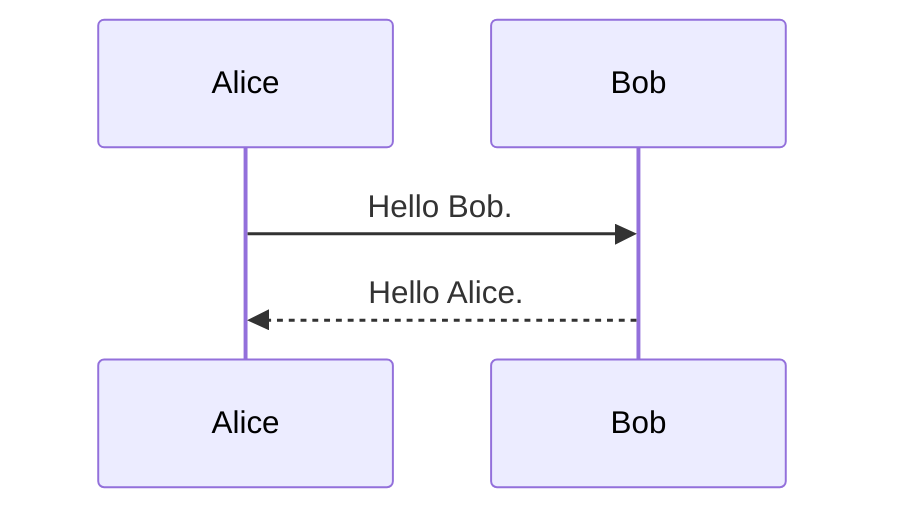

`hugo-theme-vivliocli` は、<u>**組版PDF出力できるドキュメントサイト**</u>を構築するためのHugoテーマです。このテーマでは[Vivliostyle CLI](https://github.com/vivliostyle/vivliostyle-cli) を利用することで、サイトの任意のセクションを、表紙・目次・しおり・章番号・ページ番号を含むPDFとして出力できます。

## 特徴

#### 組版PDF出力

`_pdf.md`ファイルが配置された任意のセクションを、<u>**表紙・目次・しおり・章番号・ページ番号を含む組版PDF**</u>として出力できます（[Vivliostyle CLI](https://github.com/vivliostyle/vivliostyle-cli)により実現）。出力形式は左右ページを使用する書籍スタイルと全ページが同じシンプルスタイルを選択できます。章節番号はMarkdownファイルの階層とヘッダレベルに基き自動で割り当てられます。章節番号の出力レベルや最上位レベルのフォーマット（第X章など）を指定できます。

この User Guide がHugo-theme-vivliocliによるサイトのサンプルも兼ねています。PDFは[こちら](./UserGuide.pdf)。


#### セル結合を含む複雑な表の描画

`include`ショートコードを使えば、Markdown内にcsvファイルを読み込み、複雑な表を簡単に描画することができます。垂直`||`や水平`->`のセル結合が可能です。各セルではMarkdown記法を使用できます。表の各列の幅やテキスト整列などのスタイル指定も可能です。

{}

#### MermaidとMathjaxをサポート

[Mermaid](https://mermaid.js.org/)と[Mathjax](https://www.mathjax.org/)により、強力なダイアグラム・チャート・数式描画の機能を利用することができます。



```math
\frac{\pi}{2} =
\left( \int_{0}^{\infty} \frac{\sin x}{\sqrt{x}} dx \right)^2 =
\sum_{k=0}^{\infty} \frac{(2k)!}{2^{2k}(k!)^2} \frac{1}{2k+1} =
\prod_{k=1}^{\infty} \frac{4k^2}{4k^2 - 1}
```

#### 複数エディションのPDF出力

`ShowIf` / `HideIf` ショートコードを使用して、特定のエディションでのみ出力されるブロックやファイルを書くことができます。これにより、ディティールが異なる複数エディションのPDFを出力できます。

## 使用方法

まずは <u>**[Getting Started](./Manual/GettingStarted.html)**</u> を参照してください。

## 動作環境

* [Hugo](https://gohugo.io/)(v0.94.0以降)
* [Vivliostyle CLI](https://github.com/vivliostyle/vivliostyle-cli)(v5.3.0以降)