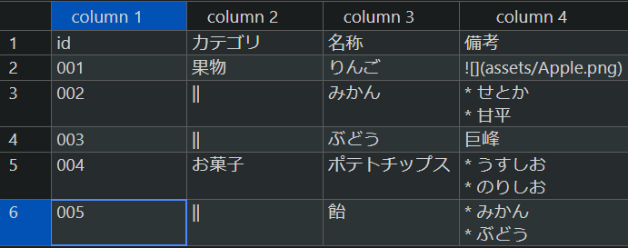

hugo-theme-vivliocli テーマで使用できるショートコードの一覧です。

## ShowIf

`config.toml`の`showIfs`で列挙されている場合に描画する部分を指定します。以下は`showIfs = ["edition1"]`とした場合に描画されるブロックです。

```bash
{}
ここにxxxをサポートする場合に表示するコンテンツを記述。
{}
```

詳しくは [エディション](./edition.html) を参照してください。

## HideIf

`config.toml`の`showIfs`で列挙されている場合に描画「しない」部分を指定します。以下は`showIfs = ["edition1"]`とした場合に描画されなくなるブロックです。

```bash
{}
ここはedition1のときのみ非表示になる。
{}
```

詳しくは [エディション](./edition.html) を参照してください。

## note

注記です。以下のように`note`ショートコードで囲まれた部分が注記としてレンダリングされます。

```
{}
ここに注記文章を記載
{}
```
{}
ここに注記文章を記載
{}

`note (title)`と言う形式で、引数にタイトルを指定することもできます。note内部にMarkdownを書くことも可能です。

```bash
{}
ここに注記文章を記載

* markdownも記載可能
  * 箇条書きレベル2
* 箇条書きレベル1
{}
```


{}
ここに注記文章を記載

* markdownも記載可能
  * 箇条書きレベル2
* 箇条書きレベル1
{}

## include

Markdownファイル、csvファイルの「部品」を用意しておき、原稿の任意の箇所に「挿し込む」事ができます。部品ファイルを`/content/<language>/_include`以下に配置しておけば、以下のショートコードでincludeすることができます。

```bash
 # /content/jp/_include/test_jp.md
 # /content/jp/_include/sample/sample_jp.md
 # /content/jp/_include/test_jp.csv
 # /(md file dir path)/test_jp.csv
```

* _includeディレクトリ内のMarkdownにはフロントマターは記載しません。
* includeショートコードは``スタイル（Markdownレンダリング無し）で記述してください。`{}`スタイル（Markdownレンダリングあり）で記述すると、csv読み込みが正しく動作しません。

### includeでcsvの特定の値のみ参照する

csvファイルについては行を決定するためのkeyと列名を指定することで特定の値のみを参照することもできます。keyには最も左の列が使われます。重複する値がある場合は最初に見つかったものが優先されます。

```bash
 # /content/jp/_include/test_jp.csv の "003" にマッチした行の "Name" 列の値
```

上記の場合、1列目の値が`003`である行の`Name`列の値がショートコードの位置に挿し込まれます。

### 高度な表をincludeする（セル結合/Markdown/幅指定/ヘッダー有無指定）

csvファイルのincludeでは、Markdownよりも高度な表を描画することができます。`||`で縦方向に結合,`->`で横方向に結合できます。



```bash
 
```


